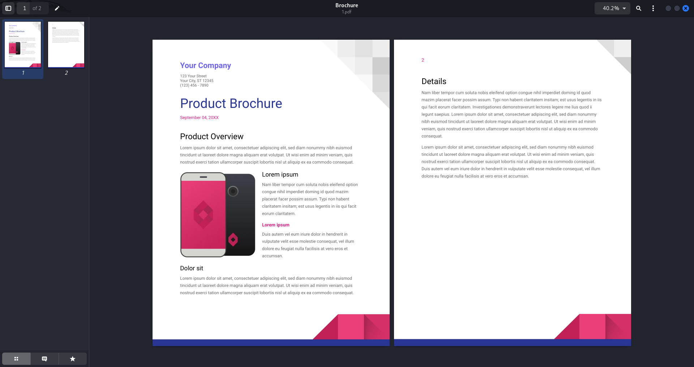
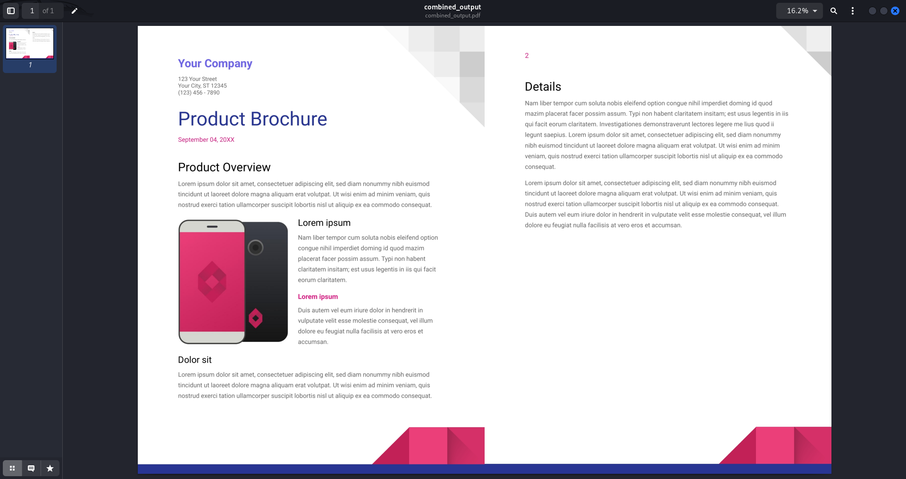

# pdf-page-merger
## Merge two pages of a PDF into one page.

 PDF Page Merger is a Python script that merges every two pages of a PDF into a single page, allowing for more compact and efficient document layouts. This tool is useful when you need to condense the number of pages in a PDF file without losing the content. The project utilizes pdf2image to convert PDF pages to images and Pillow (PIL) to manipulate and merge the images into one.

 ## Requirements

- Python 3.x
- Poppler (for converting PDF pages to images)

### Libraries

You can install the required Python libraries using `pip`:

pip install pdf2image Pillow
## Before and After

### Before Merging

### After Merging

